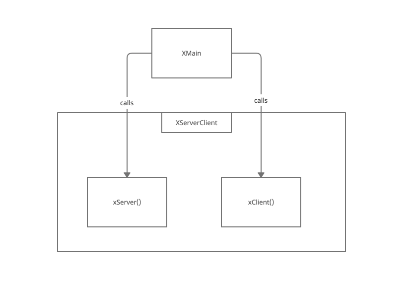
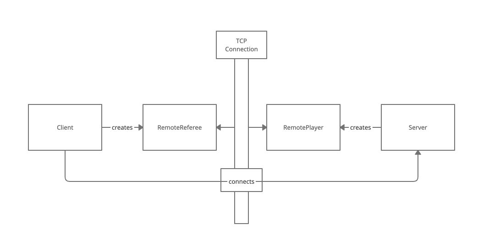
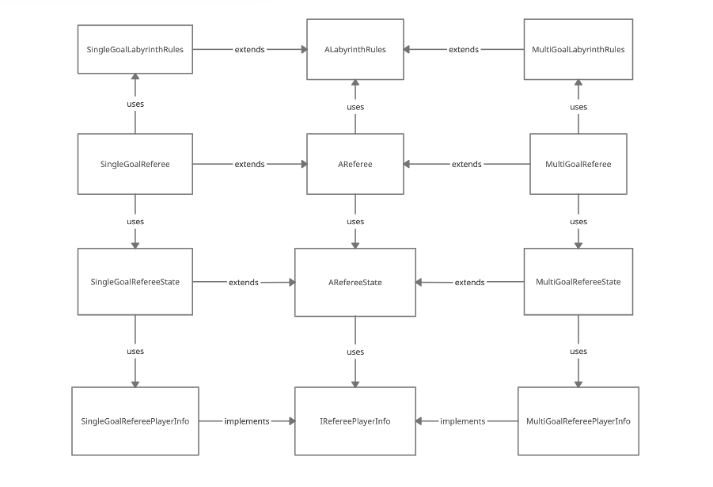
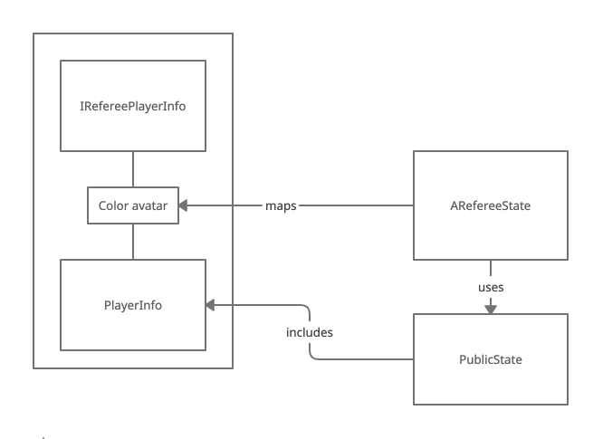
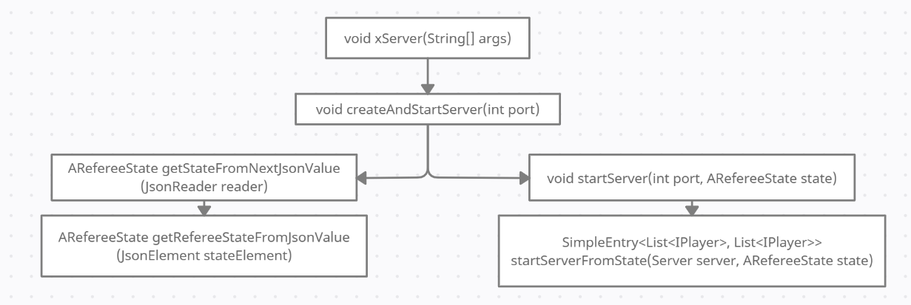
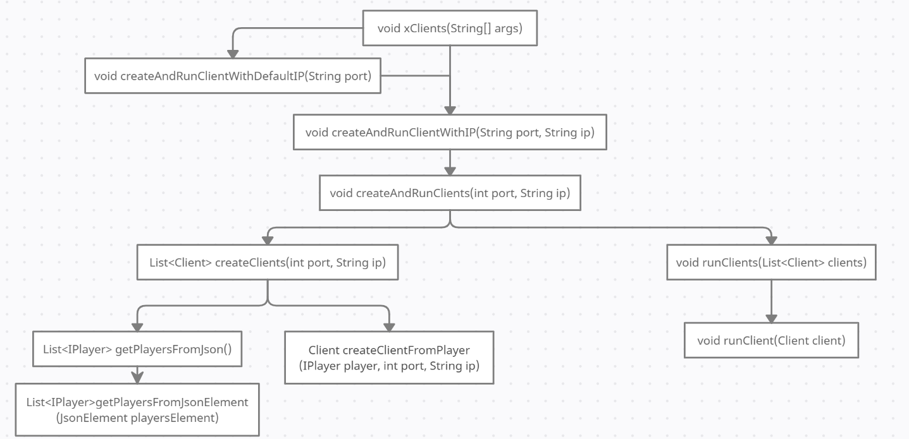
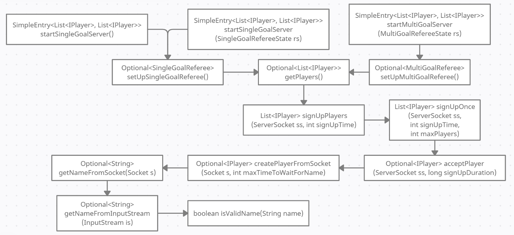
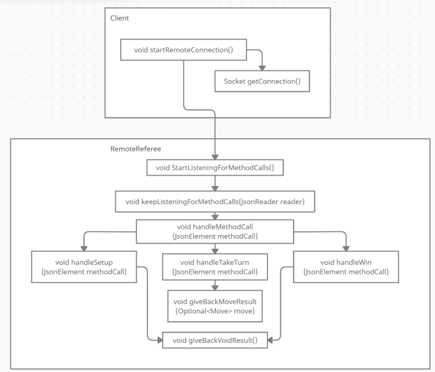

###Class Diagrams

####Main to XServerClient

####Client-Server interactions

####Multi/Single game interactions

####Referee state PlayerInfo interactions

###Method Diagrams

####xServer method diagram

####xClient method diagram

####Server method diagram

####Client-RemoteReferee method diagram

